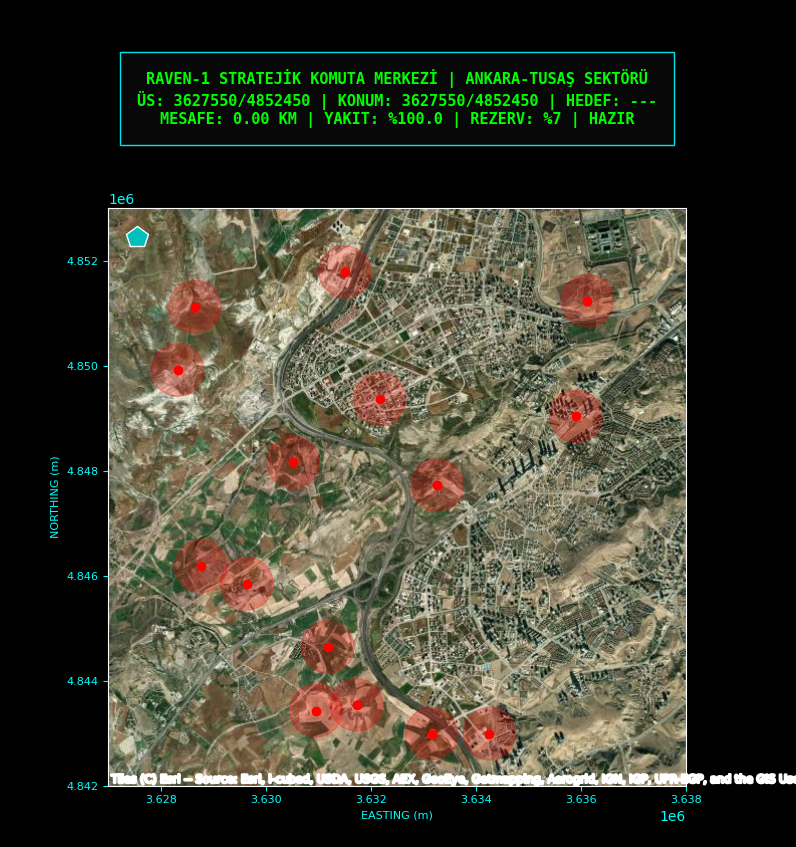
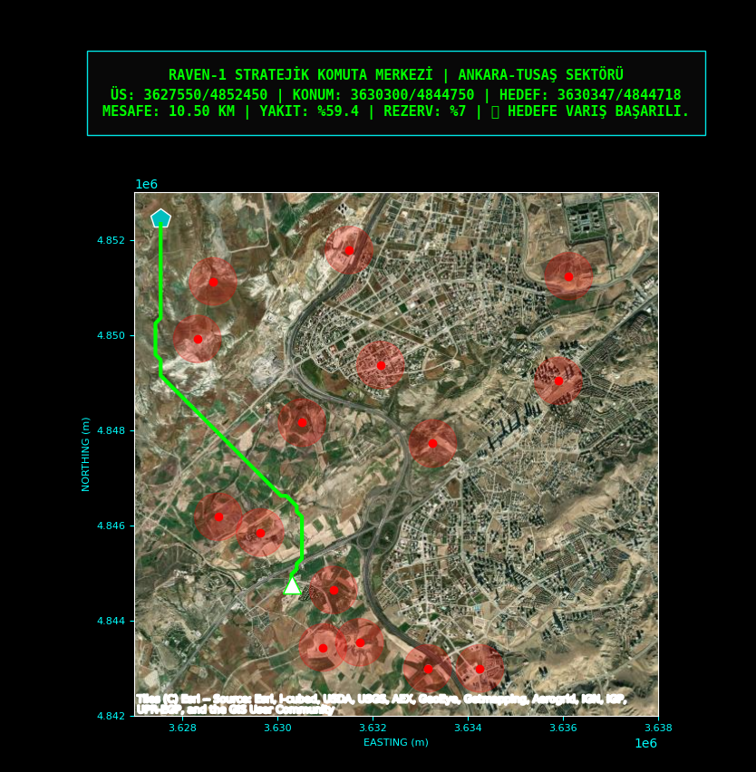
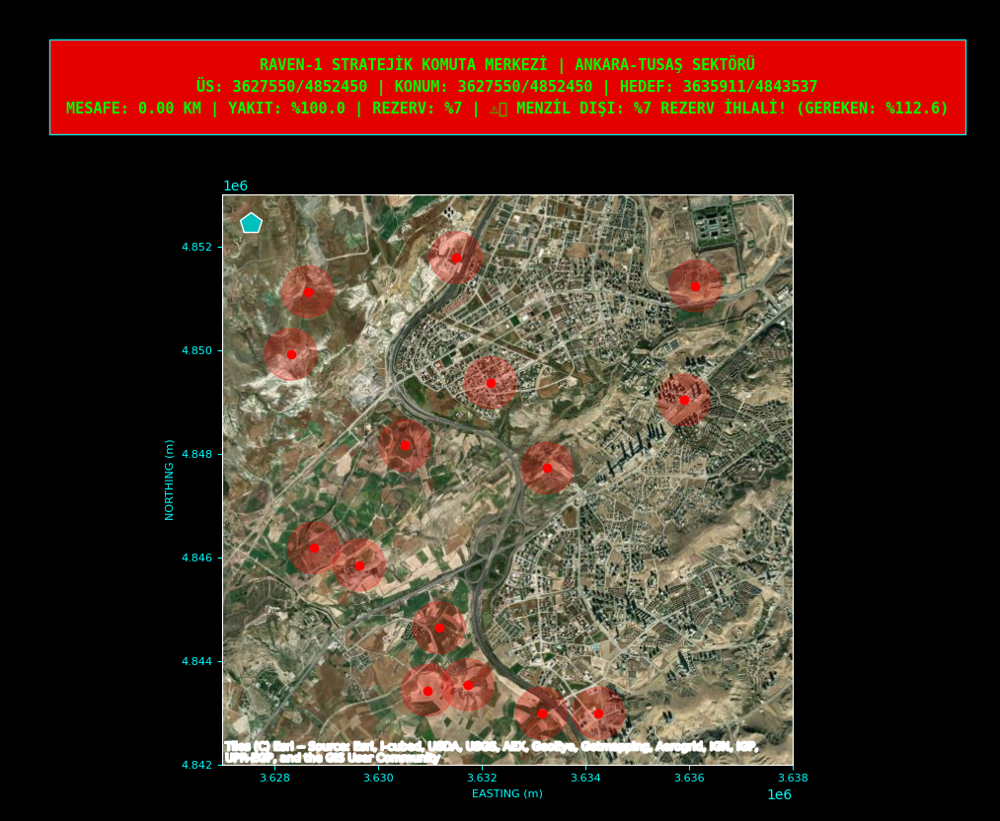

# 🛰️ Raven-Pathfinder v9.9: Otonom İHA Görev Planlama ve Radar Kaçınma Sistemi

Bu proje, Python ve modern algoritmik yaklaşımları öğrenme sürecimde geliştirdiğim, **Ankara-TUSAŞ** hava sahasını temel alan bir otonom rota planlama simülatörüdür. Projenin ana odak noktası, stratejik tehditlerden (radar) kaçınırken en verimli rotayı saniyeler içinde belirlemektir.

## 🎯 Proje Amacı
Savunma teknolojilerinde otonom sistemlerin nasıl karar aldığını anlamak ve uygulamak amacıyla;
* **Radar Mesafe Haritaları (EDT):** Tehdit unsurlarına olan mesafenin O(1) hızında analiz edilmesi,
* **Gelişmiş A* Algoritması:** Engel ve radar kaçınma zekasına sahip dinamik rota üretimi,
* **Görev Güvenliği:** Yakıt rezervi (%7) ve kritik batarya sınırlarını denetleyen lojistik yönetimdir.

## 🚀 Temel Özellikler
* **Elite Speed Engine:** EDT Cache sistemi sayesinde 100x100 haritada **10ms altı (sub-millisecond)** rota hesaplama performansı.
* **Dinamik Tehdit Analizi:** Radarlara 550 metreden fazla yaklaşmayı reddeden "Demir Duvar" kaçınma mantığı.
* **Gerçekçi Hava Sahası:** Esri World Imagery altyapısı ile TUSAŞ/Kahramankazan bölgesinin uydu haritası entegrasyonu.
* **Combat Radius Hesabı:** Gidiş-Dönüş yakıt tüketimini analiz eden ve %7 emniyet rezervini koruyan uçuş kontrolü.
* **Veri Kayıt Sistemi:** Her uçuşun SQLite veri tabanına kaydedilmesi ve uçuş planının JSON olarak dışa aktarılması.

## 🛠️ Kullanılan Teknolojiler
* **Python** (Geliştirme dili)
* **NumPy** (Matematiksel matris işlemleri)
* **Matplotlib** (HUD ve Simülasyon arayüzü)
* **Contextily** (Uydu haritası katmanı)
* **SciPy** (Mesafe dönüşüm hesaplamaları)
* **SQLite3** (Görev kayıt sistemi)

---

## 📷 Sistem Arayüzü

### 1. Komuta Merkezi ve Sektör Görünümü
Ankara-TUSAŞ sektörü üzerinde, operasyonun başlamaya hazır olduğu, tehdit unsurlarının ve üs bölgesinin (Turkuaz) tanımlandığı başlangıç ekranı.


### 2. Otonom Rota Üretimi (Radar Kaçınma)
Hedef seçildiğinde radarların (Kırmızı halkalar) etki alanına girmeden, engelleri aşan en güvenli neon-yeşil rotanın canlı simülasyonu.


### 3. Görev Sonu ve Telemetri Raporu
Hedefe varıldığında yakıt tüketiminin, gidilen mesafenin ve görev durumunun profesyonel HUD panelinde özetlenmesi.


---

## 💿 Kurulum ve Çalıştırma

1. Projeyi klonlayın ve sanal ortamı oluşturun:
```bash
git clone [https://github.com/KULLANICI_ADIN/Raven-Pathfinder.git](https://github.com/KULLANICI_ADIN/Raven-Pathfinder.git)
cd Raven-Pathfinder
python -m venv venv
.\venv\Scripts\activate

    Gerekli kütüphaneleri yükleyin:

Bash

pip install -r requirements.txt

    Simülasyonu başlatın:

Bash

python src/mission.py

📝 Geliştirici Notu

Bu çalışma, Computer Programming öğrencisi olarak algoritmik optimizasyon ve verimli veri yapısı kullanımı üzerine yaptığım bir mühendislik çalışmasıdır. Özellikle harita tarama hızındaki "Elite" skorlar, projenin gerçek zamanlı sistemlere uygunluğunu kanıtlamaktadır.

Geliştirici: Arda Karadağ | Ostim Teknik Üniversitesi